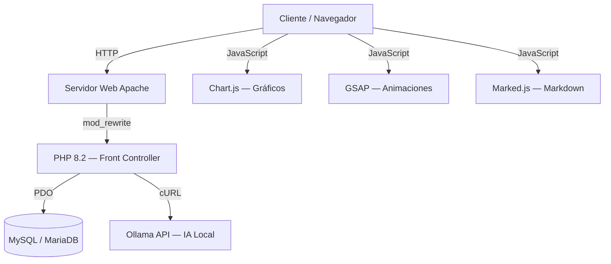

# 02 — Stack Tecnológico

## 2.1 Resumen de Tecnologías



## 2.2 Backend

| Tecnología | Versión | Uso |
|-----------|---------|-----|
| **PHP** | 8.2+ | Lenguaje principal del servidor. Arquitectura MVC pura sin frameworks externos |
| **PDO (PHP Data Objects)** | Nativo | Capa de abstracción de base de datos con prepared statements para prevenir inyección SQL |
| **PhpSpreadsheet** | 1.x | Librería para lectura y parseo de archivos Excel (.xls / .xlsx) de Sofía Plus |
| **cURL** | Nativo | Comunicación HTTP con la API de Ollama para funcionalidades de IA |

### Justificación de PHP Puro (sin framework)
Se optó por una arquitectura MVC construida desde cero en lugar de frameworks como Laravel o Symfony por las siguientes razones:
- **Rendimiento:** Al no cargar miles de clases de un framework pesado, el tiempo de respuesta es mínimo.
- **Control total:** Cada línea del código es comprensible y modificable sin depender de documentación externa.
- **Portabilidad:** Funciona en cualquier servidor con PHP 8.2 y Apache sin configuraciones complejas.
- **Aprendizaje:** Al ser un proyecto académico del SENA, permite comprender el patrón MVC en su forma más pura.

## 2.3 Base de Datos

| Tecnología | Versión | Uso |
|-----------|---------|-----|
| **MySQL** | 8.x | Motor de base de datos relacional principal |
| **MariaDB** | 10.x+ | Compatible como alternativa (incluido en WampServer) |

### Características utilizadas:
- Claves foráneas (`FOREIGN KEY`) con acciones en cascada (`ON DELETE CASCADE`, `ON DELETE SET NULL`)
- Índices únicos (`UNIQUE KEY`) para evitar duplicados
- Motor InnoDB para soporte transaccional
- Collation `utf8mb4_unicode_ci` para soporte completo de caracteres especiales

## 2.4 Frontend

| Tecnología | Versión | Uso |
|-----------|---------|-----|
| **HTML5** | — | Estructura semántica de las vistas |
| **CSS3 (Vanilla)** | — | Sistema de diseño con variables CSS, modo oscuro (Dark Mode) y glassmorphism |
| **JavaScript (ES6+)** | — | Lógica del cliente con Fetch API, manipulación del DOM y renderizado dinámico |
| **Chart.js** | 4.4.7 | Gráficos interactivos (barras, donas, líneas) |
| **GSAP** | 3.12.5 | Animaciones suaves y micro-interacciones |
| **Marked.js** | Latest | Parser de Markdown para renderizar respuestas de la IA |
| **FontAwesome** | 6.5.1 | Iconografía vectorial |

### Decisiones de Diseño:
- **No se usa Bootstrap ni Tailwind:** El sistema de diseño es completamente personalizado para lograr una identidad visual única con tema oscuro premium.
- **Variables CSS:** Todos los colores, espaciados y bordes se gestionan mediante custom properties (`--bg-main`, `--accent`, `--text-bright`, etc.).
- **Fetch API nativa:** Se prefiere sobre Axios o jQuery para mantener cero dependencias adicionales.

## 2.5 Inteligencia Artificial

| Tecnología | Versión | Uso |
|-----------|---------|-----|
| **Ollama** | Latest | Servidor de inferencia de modelos LLM locales |
| **DeepSeek-R1** | 8B | Modelo de lenguaje utilizado para análisis y predicciones |

### Capacidades de SENA-IA:
- Chat conversacional en lenguaje natural con contexto de la base de datos
- Generación dinámica de gráficos Chart.js dentro de las respuestas
- Análisis predictivo de deserción
- Streaming de respuestas via Server-Sent Events (SSE)

## 2.6 Servidor de Desarrollo

| Componente | Detalle |
|-----------|---------|
| **WampServer** | Paquete integrado Apache + MySQL + PHP para Windows |
| **Sistema Operativo** | Windows 10/11 |
| **Hosting de Producción** | InfinityFree (plan gratuito) / Compatible con cualquier hosting compartido PHP |

## 2.7 Control de Versiones

| Herramienta | Uso |
|-----------|-----|
| **Git** | Control de versiones local |
| **GitHub** | Repositorio remoto (`Aryannext/SENA_SGPD`) |

## 2.8 Diagrama de Dependencias Externas

```
SENA_SGPD
├── composer.lock ──► phpoffice/phpspreadsheet (lectura Excel)
├── CDN ──► chart.js 4.4.7 (gráficos)
├── CDN ──► gsap 3.12.5 (animaciones)
├── CDN ──► marked.js (markdown parser)
├── CDN ──► font-awesome 6.5.1 (iconos)
└── Local ──► Ollama API (inteligencia artificial)
```
