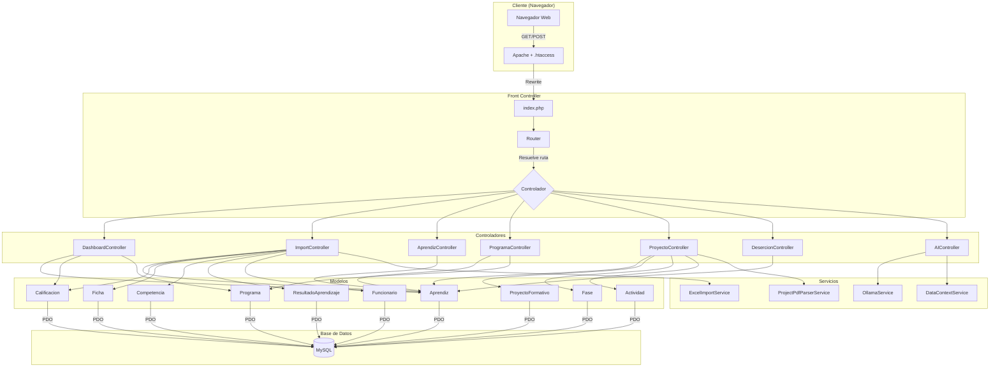
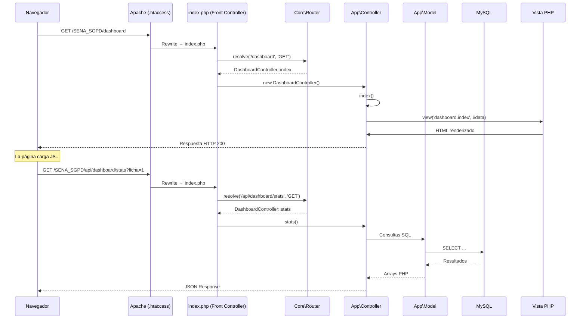

# 03 — Arquitectura del Sistema

## 3.1 Patrón Arquitectónico: MVC (Modelo-Vista-Controlador)

El sistema implementa el patrón **MVC puro** con un **Front Controller** centralizado que recibe todas las peticiones HTTP.



## 3.2 Estructura de Carpetas

```
SENA_SGPD/
├── index.php                  ← Front Controller (punto de entrada único)
├── .htaccess                  ← Reglas de reescritura Apache
├── composer.lock              ← Dependencias PHP (PhpSpreadsheet)
│
├── app/                       ← Capa de Aplicación
│   ├── Controllers/           ← Controladores (lógica de negocio)
│   │   ├── AIController.php
│   │   ├── AprendizController.php
│   │   ├── DashboardController.php
│   │   ├── DesercionController.php
│   │   ├── ImportController.php
│   │   ├── ProgramaController.php
│   │   └── ProyectoController.php
│   │
│   ├── Models/                ← Modelos (acceso a datos)
│   │   ├── Actividad.php
│   │   ├── Aprendiz.php
│   │   ├── Calificacion.php
│   │   ├── Competencia.php
│   │   ├── Fase.php
│   │   ├── Ficha.php
│   │   ├── Funcionario.php
│   │   ├── Programa.php
│   │   ├── ProyectoFormativo.php
│   │   └── ResultadoAprendizaje.php
│   │
│   └── Services/              ← Servicios (lógica reutilizable)
│       ├── DataContextService.php
│       ├── ExcelImportService.php
│       ├── OllamaService.php
│       ├── ProjectPdfParserService.php
│       └── TTSService.php
│
├── core/                      ← Framework MVC Base
│   ├── Controller.php         ← Clase abstracta base para controladores
│   ├── Model.php              ← Clase base con singleton PDO
│   └── Router.php             ← Enrutador con soporte de parámetros
│
├── config/                    ← Configuración
│   ├── database.php           ← Credenciales MySQL
│   ├── ollama.php             ← Configuración de IA (modelo, prompt)
│   └── tts.php                ← Configuración Text-to-Speech
│
├── views/                     ← Vistas (plantillas PHP)
│   ├── layouts/
│   │   └── main.php           ← Layout maestro (HTML base)
│   ├── partials/
│   │   ├── sidebar.php        ← Barra lateral de navegación
│   │   ├── header.php         ← Encabezado con breadcrumbs
│   │   └── chat_widget.php    ← Widget flotante del chat IA
│   ├── dashboard/
│   │   └── index.php          ← Vista del Dashboard principal
│   ├── aprendiz/
│   │   ├── index.php          ← Listado de aprendices
│   │   └── detalle.php        ← Perfil individual del aprendiz
│   ├── import/
│   │   └── index.php          ← Formulario de importación Excel
│   ├── programa/
│   │   └── ...                ← Vistas de programas y fichas
│   ├── proyecto/
│   │   └── ...                ← Vistas de proyecto formativo
│   ├── desercion/
│   │   └── index.php          ← Panel de análisis de deserción
│   └── chat/
│       └── index.php          ← Interfaz del chat SENA-IA
│
├── public/                    ← Assets estáticos
│   ├── css/
│   │   ├── main.css           ← Sistema de diseño completo (18.7 KB)
│   │   ├── dashboard.css      ← Estilos específicos del Dashboard
│   │   ├── chat.css           ← Estilos del módulo de chat IA
│   │   └── desercion.css      ← Estilos de deserción
│   ├── js/
│   │   ├── app.js             ← Utilidades globales (toasts, truncate)
│   │   ├── dashboard.js       ← Lógica del Dashboard (23.8 KB)
│   │   ├── chat.js            ← Lógica del chat con streaming SSE
│   │   ├── desercion.js       ← Lógica de análisis de deserción
│   │   ├── import.js          ← Lógica de importación Excel
│   │   └── voice.js           ← Text-to-Speech del chat
│   ├── uploads/               ← Archivos subidos (Excel, PDFs)
│   └── audio/                 ← Audio generado por TTS
│
├── docs/                      ← Documentación del proyecto
│   └── SGPD_SENA.sql          ← Script DDL de la base de datos
│
├── vendor/                    ← Dependencias de Composer
│   └── phpoffice/phpspreadsheet/
│
└── tts_server/                ← Servidor auxiliar TTS (Node.js)
```

## 3.3 Flujo de una Petición HTTP



## 3.4 Principios SOLID Aplicados

| Principio | Implementación |
|-----------|---------------|
| **S** — Single Responsibility | Cada Modelo gestiona una sola tabla. Cada Servicio tiene una sola responsabilidad (importar Excel, comunicar con IA, etc.) |
| **O** — Open/Closed | La clase abstracta `Controller` se extiende sin modificarse. Nuevos módulos se añaden creando nuevos controladores |
| **L** — Liskov Substitution | Todos los controladores heredan de `Core\Controller` y son intercambiables por el Router |
| **I** — Interface Segregation | Los modelos exponen solo los métodos estáticos necesarios para cada entidad |
| **D** — Dependency Inversion | Los controladores dependen de la abstracción `Core\Model`, no de conexiones PDO directas |
