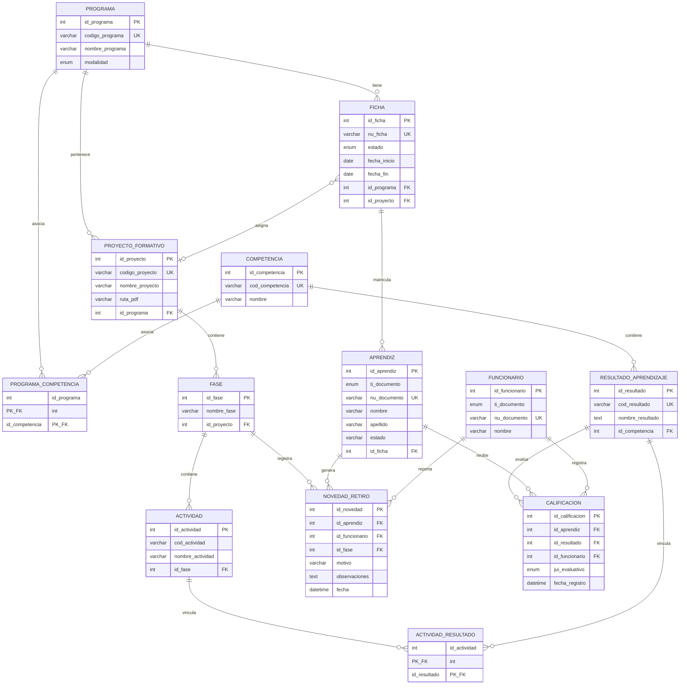

# 04 — Modelo Entidad-Relación (Base de Datos)

## 4.1 Diagrama Entidad-Relación

## 4.2 Relaciones Principales

| Relación | Tipo | Descripción |
|----------|------|-------------|
| `programa` → `ficha` | 1:N | Un programa tiene muchas fichas |
| `programa` ↔ `competencia` | N:M | Tabla pivote `programa_competencia` |
| `competencia` → `resultado_aprendizaje` | 1:N | Una competencia tiene varios resultados de aprendizaje |
| `ficha` → `aprendiz` | 1:N | Una ficha matricula muchos aprendices |
| `aprendiz` → `calificacion` | 1:N | Un aprendiz recibe muchas calificaciones |
| `resultado_aprendizaje` → `calificacion` | 1:N | Un resultado puede ser evaluado en muchas calificaciones |
| `funcionario` → `calificacion` | 1:N | Un funcionario registra muchas calificaciones |
| `proyecto_formativo` → `fase` | 1:N | Un proyecto tiene varias fases |
| `fase` → `actividad` | 1:N | Una fase contiene varias actividades |
| `actividad` ↔ `resultado_aprendizaje` | N:M | Tabla pivote `actividad_resultado` |
| `ficha` → `proyecto_formativo` | N:1 | Una ficha se asocia a un proyecto |

## 4.3 Reglas de Integridad Referencial

| Tabla Padre | Tabla Hija | Acción ON DELETE |
|------------|------------|------------------|
| `programa` | `ficha` | `SET NULL` |
| `programa` | `proyecto_formativo` | `SET NULL` |
| `ficha` | `aprendiz` | `CASCADE` |
| `aprendiz` | `calificacion` | `CASCADE` |
| `aprendiz` | `novedad_retiro` | `CASCADE` |
| `competencia` | `resultado_aprendizaje` | `CASCADE` |
| `resultado_aprendizaje` | `calificacion` | `CASCADE` |
| `funcionario` | `calificacion` | `SET NULL` |
| `proyecto_formativo` | `fase` | `CASCADE` |
| `fase` | `actividad` | `CASCADE` |

## 4.4 Motor de Almacenamiento
Todas las tablas utilizan **InnoDB** para garantizar:
- Soporte de transacciones ACID
- Bloqueo a nivel de fila
- Claves foráneas con integridad referencial
