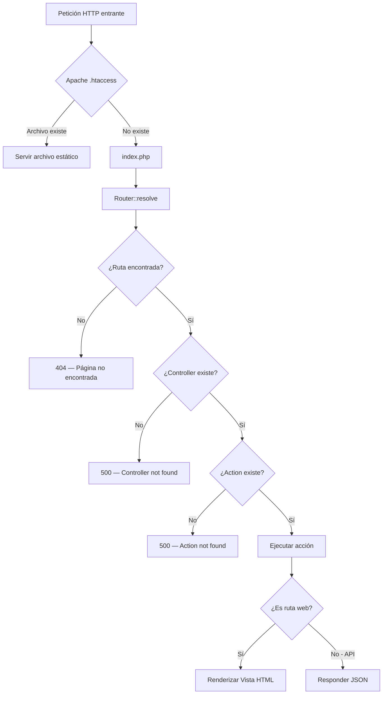

# 06 — Mapa de Rutas y Endpoints

## 6.1 Rutas Web (Vistas HTML)

Estas rutas devuelven páginas HTML completas renderizadas por el servidor.

| Método | Ruta | Controlador | Acción | Descripción |
|--------|------|-------------|--------|-------------|
| GET | `/` | DashboardController | index | Página principal (Dashboard) |
| GET | `/dashboard` | DashboardController | index | Dashboard principal |
| GET | `/dashboard/fases` | DashboardController | fases | Análisis por fases del proyecto |
| GET | `/import` | ImportController | index | Formulario de importación Excel |
| GET | `/aprendiz` | AprendizController | index | Listado de aprendices |
| GET | `/aprendiz/{id}` | AprendizController | detalle | Perfil detallado del aprendiz |
| GET | `/proyecto` | ProyectoController | index | Gestión de proyecto formativo |
| GET | `/proyecto/detalle` | ProyectoController | detalle | Detalle del proyecto |
| GET | `/proyecto/asignar` | ProyectoController | asignar | Asignar proyecto a ficha |
| GET | `/programa` | ProgramaController | index | Listado de programas |
| GET | `/programa/detalle` | ProgramaController | detalle | Detalle del programa |
| GET | `/programa/ficha` | ProgramaController | ficha | Detalle de la ficha |
| GET | `/chat` | AIController | index | Interfaz del chat SENA-IA |
| GET | `/desercion` | DesercionController | index | Panel de análisis de deserción |

---

## 6.2 API REST — Dashboard

| Método | Endpoint | Acción | Respuesta | Descripción |
|--------|----------|--------|-----------|-------------|
| GET | `/api/dashboard/fichasActivas` | fichasActivas | JSON | Lista de fichas activas con su programa |
| GET | `/api/dashboard/stats?ficha={id}` | stats | JSON | Estadísticas completas de una ficha (KPIs, gráficos, aprendices) |
| GET | `/api/dashboard/filtrar?ficha={id}&estado={estado}&doc={doc}&q={busqueda}` | filtrar | JSON | Datos filtrados del dashboard |
| GET | `/api/dashboard/deudasAprendiz?id={id}` | deudasAprendiz | JSON | Detalle de competencias pendientes de un aprendiz |
| GET | `/api/dashboard/fases-stats?ficha={id}` | fasesStats | JSON | Estadísticas de avance por fase |
| GET | `/api/dashboard/fase-detalle?ficha={id}&fase={id}` | faseDetalle | JSON | Detalle de una fase específica |

---

## 6.3 API REST — Importación

| Método | Endpoint | Acción | Body | Descripción |
|--------|----------|--------|------|-------------|
| POST | `/api/import/upload` | upload | `multipart/form-data` (archivo Excel) | Importa el archivo Excel de Sofía Plus |

---

## 6.4 API REST — Aprendiz

| Método | Endpoint | Acción | Respuesta | Descripción |
|--------|----------|--------|-----------|-------------|
| GET | `/api/aprendiz/{id}/stats` | stats | JSON | Estadísticas del aprendiz (calificaciones, competencias) |
| GET | `/api/aprendiz/list` | list | JSON | Listado de todos los aprendices |

---

## 6.5 API REST — Proyecto Formativo

| Método | Endpoint | Acción | Body | Descripción |
|--------|----------|--------|------|-------------|
| POST | `/api/proyecto/asignar` | asignarPost | JSON | Asignar proyecto a ficha |
| GET | `/api/proyecto/fases?proyecto={id}` | getFases | JSON | Obtener fases del proyecto |
| POST | `/api/proyecto/crear` | crearProyecto | JSON | Crear nuevo proyecto formativo |
| POST | `/api/proyecto/fase` | crearFase | JSON | Crear nueva fase |
| POST | `/api/proyecto/actividad` | crearActividad | JSON | Crear nueva actividad |
| POST | `/api/proyecto/upload-pdf` | uploadPdf | `multipart/form-data` | Subir PDF del proyecto |

---

## 6.6 API REST — Programa

| Método | Endpoint | Acción | Respuesta | Descripción |
|--------|----------|--------|-----------|-------------|
| GET | `/api/programa/aprendices?ficha={id}` | aprendicesFicha | JSON | Aprendices de una ficha |
| POST | `/api/programa/delete-ficha` | deleteFicha | JSON | Eliminar una ficha |

---

## 6.7 API REST — Chat IA (SENA-IA)

| Método | Endpoint | Acción | Body | Descripción |
|--------|----------|--------|------|-------------|
| POST | `/api/chat/send` | send | JSON `{message, history[]}` | Enviar mensaje al asistente IA (streaming SSE) |
| POST | `/api/chat/speak` | speak | JSON `{text}` | Convertir texto a voz (TTS) |
| POST | `/api/chat/clear` | clear | — | Limpiar historial del chat |

---

## 6.8 API REST — Deserción

| Método | Endpoint | Acción | Respuesta | Descripción |
|--------|----------|--------|-----------|-------------|
| GET | `/api/desercion/stats` | stats | JSON | Estadísticas de deserción (motivos, instructores, auditoría) |
| GET | `/api/desercion/predecir` | predecir | JSON | Predicción de deserción con IA |

---

## 6.9 Diagrama de Flujo del Router

