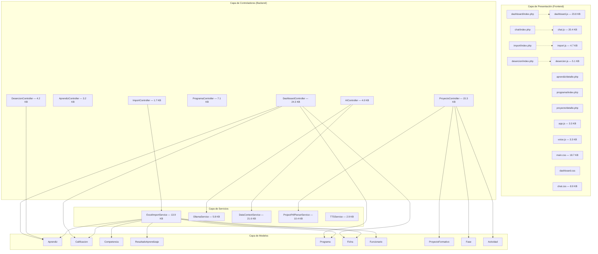

# 07 — Diagrama de Componentes

## 7.1 Vista General de Componentes

## 7.2 Controladores — Responsabilidades

### DashboardController (24.3 KB — el más complejo)
El controlador más robusto del sistema. Gestiona toda la lógica analítica.

| Método | Tipo | Descripción |
|--------|------|-------------|
| `index()` | Web | Renderiza la vista del Dashboard |
| `fases()` | Web | Renderiza la vista de análisis por fases |
| `fichasActivas()` | API | Devuelve lista de fichas activas |
| `stats()` | API | Calcula KPIs, histograma, foco de atención, avance por competencia |
| `filtrar()` | API | Aplica filtros de estado, documento y búsqueda |
| `deudasAprendiz()` | API | Detalla las competencias pendientes de un aprendiz |
| `fasesStats()` | API | Estadísticas de avance por fase |
| `faseDetalle()` | API | Detalle de resultados de una fase específica |

### ImportController (1.7 KB)
| Método | Tipo | Descripción |
|--------|------|-------------|
| `index()` | Web | Formulario de carga de archivos |
| `upload()` | API | Recibe el archivo Excel, invoca `ExcelImportService` |

### AprendizController (3.2 KB)
| Método | Tipo | Descripción |
|--------|------|-------------|
| `index()` | Web | Listado general de aprendices |
| `detalle($id)` | Web | Perfil individual con calificaciones |
| `stats($id)` | API | Estadísticas JSON del aprendiz |
| `list()` | API | Listado JSON de aprendices |

### ProgramaController (7.1 KB)
| Método | Tipo | Descripción |
|--------|------|-------------|
| `index()` | Web | Listado de programas con fichas |
| `detalle()` | Web | Detalle de un programa |
| `ficha()` | Web | Detalle de una ficha |
| `aprendicesFicha()` | API | Aprendices de una ficha |
| `deleteFicha()` | API | Elimina una ficha |

### ProyectoController (15.3 KB)
| Método | Tipo | Descripción |
|--------|------|-------------|
| `index()` | Web | Gestión de proyectos formativos |
| `detalle()` | Web | Detalle con fases y actividades |
| `asignar()` | Web | Formulario para asignar proyecto a ficha |
| `crearProyecto()` | API | Crea un proyecto nuevo |
| `crearFase()` | API | Crea una fase |
| `crearActividad()` | API | Crea una actividad |
| `uploadPdf()` | API | Sube y parsea el PDF del proyecto |
| `asignarPost()` | API | Asigna proyecto a ficha |

### AIController (4.0 KB)
| Método | Tipo | Descripción |
|--------|------|-------------|
| `index()` | Web | Interfaz del chat SENA-IA |
| `send()` | API | Envía mensaje y transmite respuesta por SSE |
| `speak()` | API | Convierte texto a audio (TTS) |
| `clear()` | API | Limpia el historial de sesión |

### DesercionController (4.2 KB)
| Método | Tipo | Descripción |
|--------|------|-------------|
| `index()` | Web | Panel de análisis de deserción |
| `stats()` | API | Estadísticas de motivos y auditoría |
| `predecir()` | API | Predicción de deserción con IA |

---

## 7.3 Servicios — Responsabilidades

| Servicio | Tamaño | Responsabilidad |
|----------|--------|----------------|
| **ExcelImportService** | 13.9 KB | Parsea archivos Excel de Sofía Plus, detecta columnas automáticamente, normaliza datos e inserta en la BD |
| **OllamaService** | 5.8 KB | Cliente HTTP para la API de Ollama. Soporta chat síncrono y streaming SSE |
| **DataContextService** | 21.6 KB | Recopila datos de la BD y los formatea como contexto textual para inyectar en los prompts de la IA |
| **ProjectPdfParserService** | 10.4 KB | Extrae fases y actividades de archivos PDF de proyectos formativos |
| **TTSService** | 2.9 KB | Text-to-Speech: convierte texto de la IA a audio reproducible |

---

## 7.4 Modelos — Métodos Clave

| Modelo | Tabla | Métodos principales |
|--------|-------|-------------------|
| **Aprendiz** | `aprendiz` | `findAll()`, `findById()`, `findByDocumento()`, `insertIgnore()`, `countByEstado()`, `countTotal()` |
| **Calificacion** | `calificacion` | `insertIgnore()`, `findByAprendiz()`, `avancePorCompetencia()` |
| **Competencia** | `competencia` | `insertIgnore()`, `asignarPrograma()` |
| **ResultadoAprendizaje** | `resultado_aprendizaje` | `insertIgnore()`, `findByCompetencia()` |
| **Programa** | `programa` | `findAll()`, `findById()`, `insertIgnore()`, `findWithStats()` |
| **Ficha** | `ficha` | `findAll()`, `findById()`, `insertIgnore()`, `findByPrograma()` |
| **Funcionario** | `funcionario` | `insertIgnore()` |
| **ProyectoFormativo** | `proyecto_formativo` | `findAll()`, `findById()`, `create()` |
| **Fase** | `fase` | `findByProyecto()`, `create()` |
| **Actividad** | `actividad` | `findByFase()`, `create()`, `vincularResultado()` |
