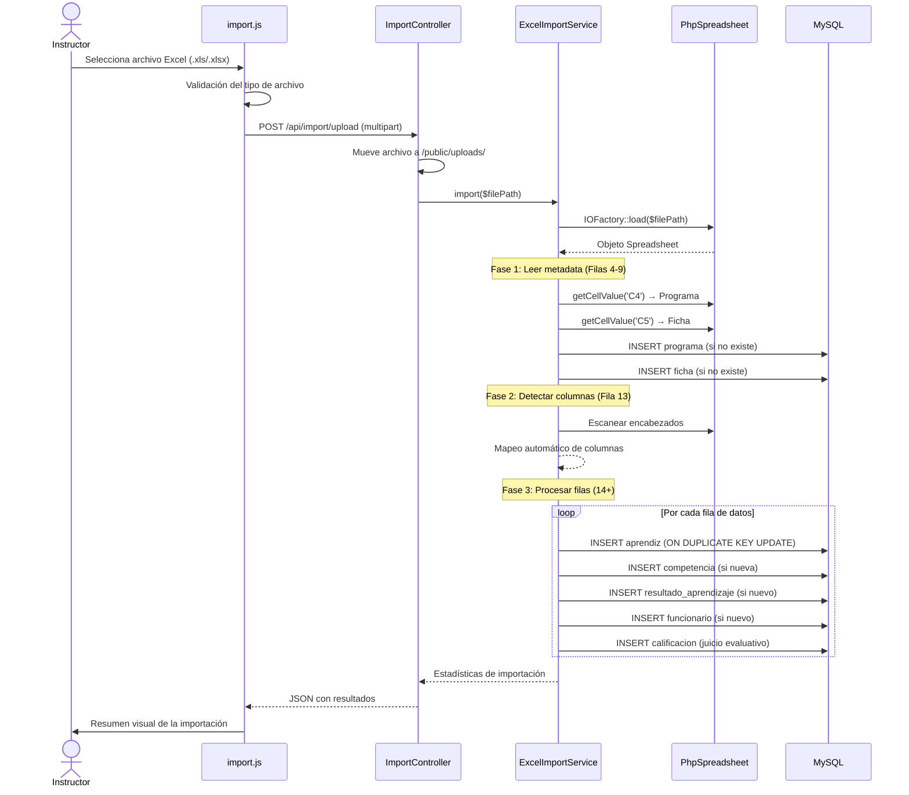
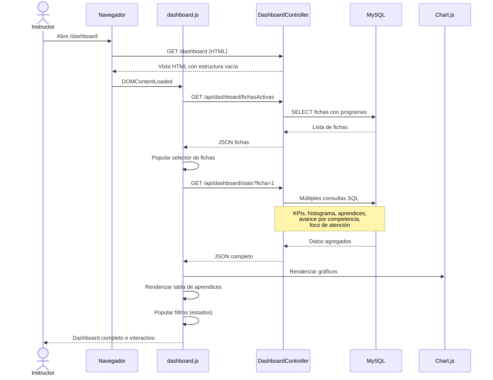
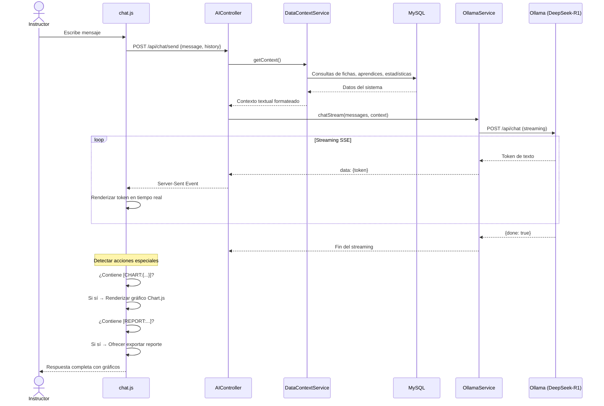
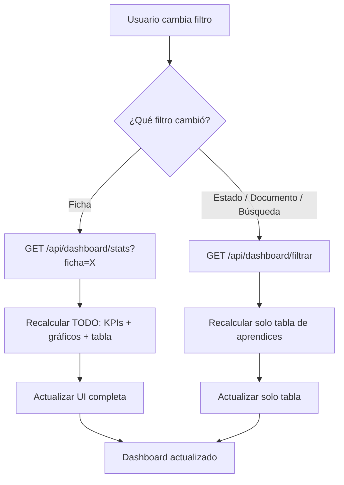
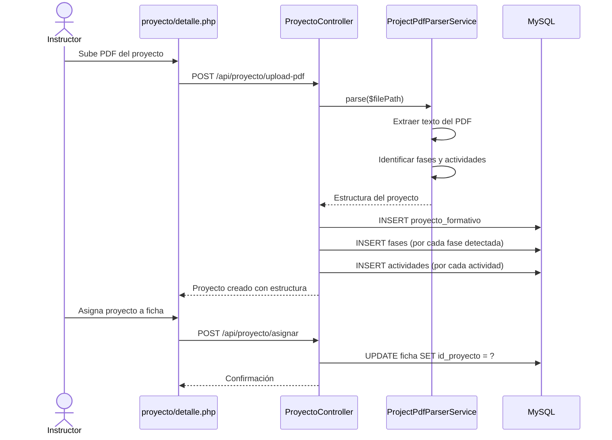
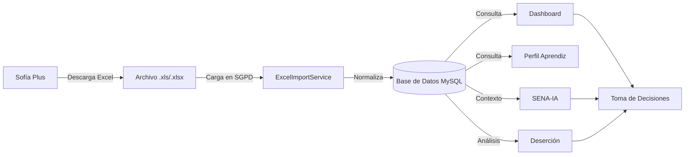

# 08 — Flujos de Proceso

## 8.1 Proceso de Importación de Datos (Excel → Base de Datos)

Este es el proceso más crítico del sistema. Transforma un archivo Excel descargado de Sofía Plus en datos normalizados en la base de datos.

### Detalle del Mapeo Automático de Columnas

El servicio escanea la fila 13 del Excel buscando estas palabras clave:

| Palabra clave en encabezado | Campo mapeado |
|---------------------------|---------------|
| "Tipo" + "Doc" | `tiDoc` (tipo de documento) |
| "Número" + "Doc" | `nuDoc` (número de documento) |
| "Nombre" (sin "Doc") | `nombre` |
| "Apellido" | `apellido` |
| "Estado" | `estado` |
| "Competencia" | `compRaw` (código + nombre) |
| "Resultado" | `resRaw` (código + nombre) |
| "Juicio" (sin "Fecha"/"Funcionario") | `juicio` |
| "Fecha" + "Juicio" | `fechaJuicio` |
| "Funcionario" | `funcRaw` |

---

## 8.2 Proceso de Consulta del Dashboard

---

## 8.3 Proceso del Chat SENA-IA

---

## 8.4 Proceso de Filtrado del Dashboard

---

## 8.5 Proceso de Creación de Proyecto Formativo

---

## 8.6 Ciclo de Vida de los Datos

