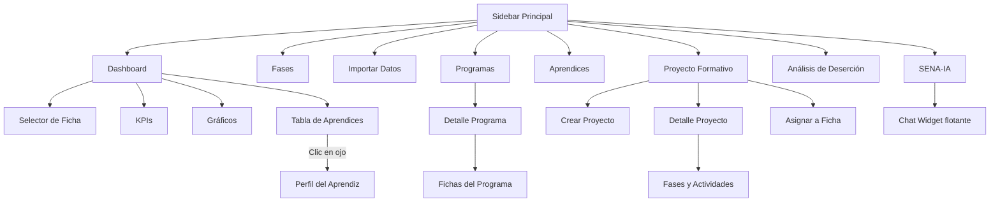

# 09 — Módulos Funcionales

## 9.1 Módulo: Dashboard Principal

### Propósito
Panel analítico central que muestra el estado del progreso académico de los aprendices de una ficha en tiempo real.

### Características
- **Selector de Ficha:** Permite cambiar entre fichas activas para visualizar datos diferentes.
- **KPIs (Indicadores Clave):**
  - Total de aprendices
  - Promedio de avance (%)
  - Aprendices en formación vs. retirados
- **Gráfico de Histograma:** Distribución del rendimiento (Crítico, Rezagado, Al Día, Adelantado).
- **Gráfico de Avance por Competencia:** Barras horizontales con el porcentaje de aprobación de cada competencia.
- **Tabla de Aprendices:** Tabla interactiva con nombre, estado, resultados aprobados/totales, porcentaje de avance y barra de progreso visual.
- **Foco de Atención:** Tooltip flotante que muestra las competencias pendientes y el instructor responsable al pasar el mouse sobre un aprendiz.
- **Filtros:** Estado del aprendiz, búsqueda por nombre/documento.

### Archivos Involucrados
- Vista: `views/dashboard/index.php`
- JS: `public/js/dashboard.js` (23.8 KB)
- CSS: `public/css/dashboard.css`
- Backend: `app/Controllers/DashboardController.php` (24.3 KB)

---

## 9.2 Módulo: Análisis por Fases

### Propósito
Visualización del avance académico organizado por las fases del proyecto formativo (Análisis, Planeación, Ejecución, Evaluación).

### Características
- Tarjetas por fase con porcentaje de avance
- Desglose de resultados de aprendizaje por fase
- Identificación de fases con mayor rezago

### Archivos Involucrados
- Vista: `views/dashboard/index.php` (modo fases)
- Backend: `DashboardController::fasesStats()` y `faseDetalle()`

---

## 9.3 Módulo: Importar Datos

### Propósito
Automatizar la carga de archivos Excel descargados de Sofía Plus hacia la base de datos normalizada.

### Características
- Drag & Drop para subir archivos Excel (.xls/.xlsx)
- Detección automática de columnas (no depende de posiciones fijas)
- Barra de progreso durante la importación
- Resumen estadístico post-importación (filas procesadas, aprendices nuevos, errores)
- Prevención de duplicados con `INSERT IGNORE` y `ON DUPLICATE KEY UPDATE`

### Formato de Excel Soportado
El sistema lee el "Reporte de Juicios Evaluativos" de Sofía Plus:
- **Filas 4-9:** Metadata (nombre del programa, número de ficha, estado)
- **Fila 13:** Encabezados de columnas
- **Filas 14+:** Datos de aprendices con sus calificaciones

### Archivos Involucrados
- Vista: `views/import/index.php`
- JS: `public/js/import.js`
- Backend: `app/Controllers/ImportController.php`
- Servicio: `app/Services/ExcelImportService.php` (13.9 KB)

---

## 9.4 Módulo: Programas de Formación

### Propósito
Gestión y consulta de programas de formación con sus fichas y aprendices asociados.

### Características
- Listado de todos los programas importados
- Detalle del programa con estadísticas
- Gestión de fichas (ver aprendices, eliminar fichas)
- Conteo de aprendices por ficha

### Archivos Involucrados
- Vista: `views/programa/index.php`, `detalle.php`, `ficha.php` (dentro de la carpeta programa)
- Backend: `app/Controllers/ProgramaController.php`
- Modelos: `Programa.php`, `Ficha.php`

---

## 9.5 Módulo: Aprendices

### Propósito
Perfil individual de cada aprendiz con su historial completo de calificaciones.

### Características
- Listado general de aprendices con búsqueda
- Perfil detallado con:
  - Datos personales (documento, nombre, estado)
  - Ficha y programa asociados
  - Tabla de calificaciones por competencia y resultado de aprendizaje
  - Instructor que evaluó cada resultado
  - Indicadores visuales (APROBADO en verde, NO APROBADO en rojo, POR EVALUAR en amarillo)

### Archivos Involucrados
- Vista: `views/aprendiz/index.php`, `detalle.php`
- Backend: `app/Controllers/AprendizController.php`
- Modelos: `Aprendiz.php`, `Calificacion.php`

---

## 9.6 Módulo: Proyecto Formativo

### Propósito
Estructurar el proyecto formativo con sus fases, actividades y vincular resultados de aprendizaje.

### Características
- Crear proyectos formativos con código y nombre
- Subir PDF del proyecto (extracción automática de fases y actividades)
- Crear fases manualmente (Análisis, Planeación, Ejecución, Evaluación)
- Crear actividades dentro de cada fase
- Vincular resultados de aprendizaje a actividades
- Asignar proyecto a fichas

### Archivos Involucrados
- Vistas: `views/proyecto/index.php`, `detalle.php`, `asignar.php`
- Backend: `app/Controllers/ProyectoController.php` (15.3 KB)
- Servicio: `app/Services/ProjectPdfParserService.php`
- Modelos: `ProyectoFormativo.php`, `Fase.php`, `Actividad.php`

---

## 9.7 Módulo: Análisis de Deserción

### Propósito
Monitorear y analizar los retiros, cancelaciones y traslados de aprendices.

### Características
- Gráfico de dona con motivos de retiro
- Gráfico de barras con retiros por instructor
- Tabla de trazabilidad (auditoría) con fecha, aprendiz, fase de abandono, motivo e instructor
- Predicción de deserción con IA (Ollama)

### Archivos Involucrados
- Vista: `views/desercion/index.php`
- JS: `public/js/desercion.js`
- CSS: `public/css/desercion.css`
- Backend: `app/Controllers/DesercionController.php`

---

## 9.8 Módulo: SENA-IA (Chat Inteligente)

### Propósito
Asistente virtual con inteligencia artificial que permite consultar datos del sistema en lenguaje natural.

### Características
- Chat conversacional en tiempo real con streaming de respuestas
- Personalidad colombiana configurada (SENA-IA)
- Contexto automático: inyecta datos de la BD en cada consulta
- Generación dinámica de gráficos Chart.js dentro de las respuestas
- Generación de reportes exportables
- Text-to-Speech (lectura en voz alta)
- Widget flotante accesible desde cualquier página
- Renderizado de Markdown en las respuestas

### Motor de IA
- **Ollama** ejecutándose localmente en `http://127.0.0.1:11434`
- **Modelo:** DeepSeek-R1 8B
- **Temperatura:** 0.3 (respuestas consistentes)
- **Contexto:** 4096 tokens

### Archivos Involucrados
- Vista: `views/chat/index.php`
- Widget: `views/partials/chat_widget.php`
- JS: `public/js/chat.js` (20.4 KB), `public/js/voice.js`
- CSS: `public/css/chat.css` (8.9 KB)
- Backend: `app/Controllers/AIController.php`
- Servicios: `OllamaService.php`, `DataContextService.php`, `TTSService.php`
- Config: `config/ollama.php`, `config/tts.php`

---

## 9.9 Mapa de Navegación del Sistema

